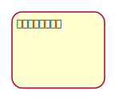
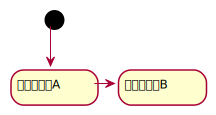
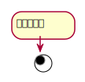
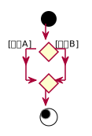
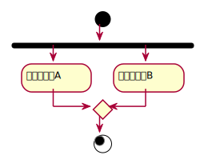
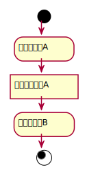
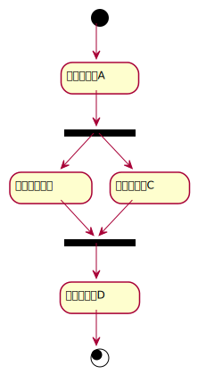
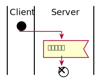
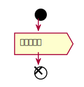
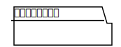

# アクティビティ図

## ・アクティビティ図とは  
処理と処理の順番を表現するための図  
ユースケースのイベントフローを表現する時にも利用可能  

## ・アクティビティ  
アクションやオブジェクトノードを「意味のある一連の流れ」としてまとめた要素  

## ・アクションと制御フロー  
&nbsp;&nbsp;アクション  
&nbsp;&nbsp;&nbsp;&nbsp;モデリングの対象が行う個々の活動や処理を表現する要素  
&nbsp;&nbsp;&nbsp;&nbsp;四隅が丸い四角形で表記  

&nbsp;&nbsp;制御フロー  
&nbsp;&nbsp;&nbsp;&nbsp;アクションから別のアクションへ制御が移ることを表現する要素  
&nbsp;&nbsp;&nbsp;&nbsp;頭に矢印が付いた実践で表記    

  

## ・開始ノード  
アクティビティの開始を表現する要素  
黒丸のアイコンで表現  
図は「アクションと制御フロー」の「制御フロー」を参照  

## ・アクティビティ終了ノード  
アクティビティの終了を表現する要素  
内側が黒く塗りつぶされた二重丸で表現  
無限ループで待機するようなアクティビティには表記しない場合もある  
基本的に、アクションに対してアクティビティ終了ノードは1つだが、複数の表記も可  

## ・デシジョンノード  
条件に応じてフローが分岐することを表現する要素  
分岐する条件はガードで定義する  
ガードは分岐先のアクションへ移ることができるかどうかを判断するための条件  
デシジョンノードを使う場合はガードが必須  

## ・マージノード  
別々のフローが合流して1つのフローになることを表現する要素  

  

## ・オブジェクトノードとオブジェクトフロー  
&nbsp;&nbsp;オブジェクトノード  
&nbsp;&nbsp;&nbsp;&nbsp;アクティビティで取り扱うオブジェクトを表現する要素  

&nbsp;&nbsp;オブジェクトフロー    
&nbsp;&nbsp;&nbsp;&nbsp;オブジェクトの入出力関係を表現する要素  

  

## ・フォークノードとジョインノード  
&nbsp;&nbsp;フォークノード  
&nbsp;&nbsp;&nbsp;&nbsp;複数のアクションを並行して実行することを表現する要素  
&nbsp;&nbsp;&nbsp;&nbsp;1つの入力フローに対して複数の出力のフローを表記  

&nbsp;&nbsp;ジョインノード  
&nbsp;&nbsp;&nbsp;&nbsp;複数の入力フローに対して1つの出力フローがあることを表現する要素  

  

## ・イベント受信アクション  
外部からのイベント受信を表現する要素  

## ・シグナル送信アクション  
アクティビティから外部にシグナルを送信する場合に、シグナルの送信を表現する要素  

## ・パーティション  
アクティビティ内の複数のアクションを役割ごとに分けて表記する要素  
横向きでの表記も可  
  

## ・アクティビティ図の注意点
概念的なアクションと詳細なアクションを混合して表現したり、  
多くのデシジョンノードやマージノードを図中に登場させると描くのも読むのも大変な労力となる  
図の一部だけを特に具体的に、あるいは抽象的に表現してしまうと、読み手の混乱を招く  
1つの図で表現する物事のレベルを合わせる必要がある  