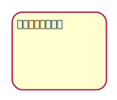
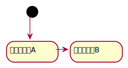
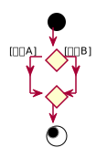

# アクティビティ図

## ・アクティビティ図とは  
処理と処理の順番を表現するための図  
ユースケースのイベントフローを表現する時にも利用可能  

## ・アクティビティ  
アクションやオブジェクトノードを「意味のある一連の流れ」としてまとめた要素  

## ・アクションと制御フロー  
&nbsp;&nbsp;アクション  
&nbsp;&nbsp;&nbsp;&nbsp;モデリングの対象が行う個々の活動や処理を表現する要素  
&nbsp;&nbsp;&nbsp;&nbsp;四隅が丸い四角形で表記  

&nbsp;&nbsp;制御フロー  
&nbsp;&nbsp;&nbsp;&nbsp;アクションから別のアクションへ制御が移ることを表現する要素  
&nbsp;&nbsp;&nbsp;&nbsp;頭に矢印が付いた実践で表記    

  

## ・開始ノード  
アクティビティの開始を表現する要素  
黒丸のアイコンで表現  
図は「アクションと制御フロー」の「制御フロー」を参照  

## ・アクティビティ終了ノード  
アクティビティの終了を表現する要素  
内側が黒く塗りつぶされた二重丸で表現  
無限ループで待機するようなアクティビティには表記しない場合もある  
基本的に、アクションに対してアクティビティ終了ノードは1つだが、複数の表記も可  

## ・デシジョンノード  
条件に応じてフローが分岐することを表現する要素  
分岐する条件はガードで定義する  
ガードは分岐先のアクションへ移ることができるかどうかを判断するための条件  
デシジョンノードを使う場合はガードが必須  

## ・マージノード  
別々のフローが合流して1つのフローになることを表現する要素  

## ・オブジェクトノードとオブジェクトフロー  
&nbsp;&nbsp;オブジェクトノード  
&nbsp;&nbsp;&nbsp;&nbsp;アクティビティで取り扱うオブジェクトを表現する要素  

&nbsp;&nbsp;オブジェクトフロー    
&nbsp;&nbsp;&nbsp;&nbsp;オブジェクトの入出力関係を表現する要素  

