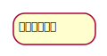

# アクティビティ図

## ・アクティビティ図とは  
処理と処理の順番を表現するための図  
ユースケースのイベントフローを表現する時にも利用可能  

## ・アクティビティ  
アクションやオブジェクトノードを「意味のある一連の流れ」としてまとめた要素  

## ・アクションと制御フロー  
&nbsp;&nbsp;アクション  
&nbsp;&nbsp;&nbsp;&nbsp;モデリングの対象が行う個々の活動や処理を表現する要素  
&nbsp;&nbsp;&nbsp;&nbsp;四隅が丸い四角形で表記  

&nbsp;&nbsp;制御フロー  
&nbsp;&nbsp;&nbsp;&nbsp;アクションから別のアクションへ制御が移ることを表現する要素  
&nbsp;&nbsp;&nbsp;&nbsp;頭に矢印が付いた実践で表記    

  

## ・開始ノード  
アクティビティの開始を表現する要素  
黒丸のアイコンで表現  
図は「アクションと制御フロー」の「制御フロー」を参照  

