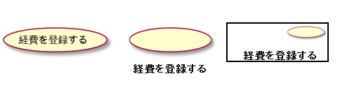
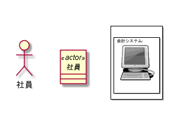
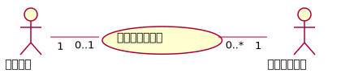
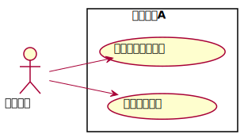
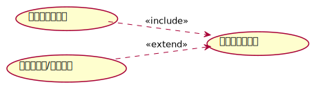
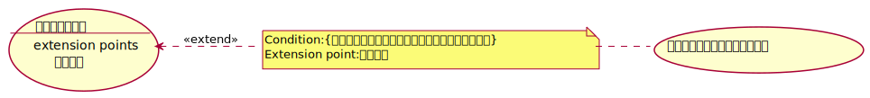
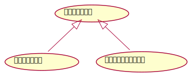
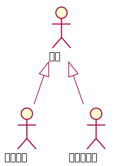

# ユースケース図

## ・ユースケース図を描く意義    
システムで実現すべき目的をシステムにおけるユースケーすとアクターとの関係として図示したもの  

## ・ユースケース  
表記法が複数ある。以下で挙げるものはどれも同じ意味  
&nbsp;&nbsp;・楕円の中にユースケース名を配置する方法  
&nbsp;&nbsp;・楕円の下にユースケース名を配置する方法  
&nbsp;&nbsp;・右上に楕円をつけた長方形の中にユースケース名を配置する方法  
&nbsp;&nbsp;
  
## ・アクター  
検討対象のシステムの利用者のことである  
検討対象のシステムを利用する人間としてのユーザだけではなく、ハードウェアや外部システム  
といった人間以外の要素も含む  
アクターは基本的には左側の人間の形をしたアイコンで表記する  
中央の例のように「クラス」に「actor」という「ステレオタイプ」をつけて表記することもある  
右側の例のように、任意のアイコンを使用する表記方法もある  
アクターは特定の物理的存在ではないことに注意する必要がある  

  

## ・関連  
どのユースケースがどのアクターから利用されるのかを表現する  

## ・システム境界  
ユースケースを囲むように枠線をつける  
システムで実現すべてき範囲が明確になる  
 

 ## ・ユースケースの包含  
 複数のユースケースから共通利用されるユースケースとの間に存在する関係  
 共通利用するユースケース側から共通利用されるユースケース側へ、頭に矢印が付いた破線を引き  
 ステレオタイプを付記する  
 包含するユースケース側から見た場合、包含されるユースケースはオプショナルではなく、必ず利用される  
    

## ・ユースケースの拡張  
条件付きで他のユースケースを利用することを指す  
オプショナルなユースケース側からそれを利用するユースケース側へ頭に矢印が付いた破線を引き  
ステレオタイプ<\<extend>>を付記する
オプショナルなユースケースへ分岐する箇所を拡張点という。    
拡張点は、ユースケースの楕円の中、ユースケース名の下に線を引き、その下にキーワードを付けて描画  
また、拡張点でオプショナルなユースケースが利用される具体的な条件は、ノートで付記可能  
  

## ・ユースケースの汎化  
ユースケース間の「is-a」関係を表現したもの  
個別機能を持つユースケース側から共通機能を持つユースケース側へ、  
頭に白抜きの三角形が付いた実線を引いて表現  
共通機能を持つユースケースのうち、アクターから直接利用されないものは、  
「抽象ユースケース」といい、ユースケース名をイタリック体で描く  
  

## ・アクターの汎化  
個別アクター側から共通アクター側へ、頭に白抜きの三角形が付いた実線を引いて表現  
アクターのうち、特に「インスタンス」を持たないものを「抽象アクター」という  
抽象アクターは、アクター名をイタリック体で描く  
  