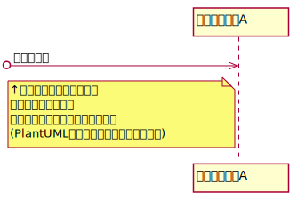
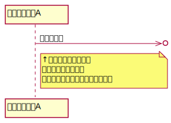

# シーケンス図

## ・ファウンドメッセージ
送信側のライフラインを図中に明示しないメッセージ  
★使用するケース★  
・送信側が他のシーケンス図に存在する  
・特に送信側のライフラインを表記する必要がない

## ・ロストメッセージ
受信側のライフラインを図中に明示しないメッセージ  
★使用するケース★
 
・受信側が他のシーケンス図に存在する
 
・特に受信側のライフラインを表記する必要がない

