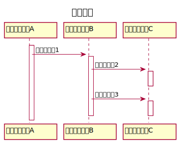
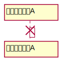
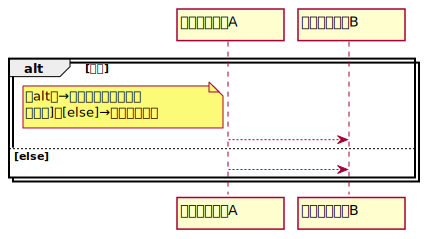
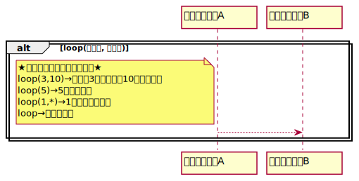

# シーケンス図

## ・実行指定
メッセージ受信からメッセージの内容が終了するまでの期間を表わす  
白抜きの長方形をライフラインの破線上に表記

## ・破棄イベント
ライフラインの消滅を表現する  
破棄イベント以降は、メッセージの受信と送信がない  

## ・結合フラグメント
繰り返し、分岐といった制御構造を表現する  
 
　★各要素の説明  
　　・相互作用オペレーター  
　　→制御構造の種類を指定する  
　　・相互作用制約  
　　→実行条件を角括弧内に指定する  
　　  
 
　★ループ  
　　ループ回数は正の整数で指定し、最大値と最小値は省略可能  
　　  