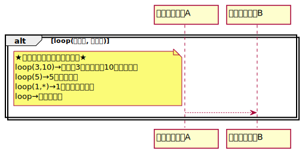

# シーケンス図

## ・実行指定
メッセージ受信からメッセージの内容が終了するまでの期間を表わす  
白抜きの長方形をライフラインの破線上に表記

## ・破棄イベント
ライフラインの消滅を表現する  
破棄イベント以降は、メッセージの受信と送信がない  

## ・結合フラグメント  
繰り返し、分岐といった制御構造を表現する  
 
　★各要素の説明  
　　・相互作用オペレーター  
　　→制御構造の種類を指定する  
　　・相互作用制約  
　　→実行条件を角括弧内に指定する  
　　  
 
　★ループ  
　　メッセージが繰り返し送信されることを表現する    
　　ループ回数は正の整数で指定し、最大値と最小値は省略可能  
　　  
 
　★オルタナティブ  
　　条件が成立したときに送信するメッセージを、破線で区切られた領域に表記  
　　補足として、条件はいくつ設定してもよい   
　　  
 
　★オプション  
　　メッセージを送信する/送信しないの選択の場合に使用することで、意図がより明確になる  
　　相互作用制約で指定した条件が成立した場合、オプション内のメッセージを送信  
　　  

## ・相互作用の利用  
相互作用を分画して描いた場合、ある相互作用から別の相互作用を呼び出すことを指す  
外部とどのようなメッセージを送受信するかを定義する必要がある  
フレーム名を「ref」としたフレームで表記する  
　　  
相互作用のメッセージを受信する場合、フレームからライフラインのメッセージとして表現する  
この時のフレームとメッセージの接点を「ゲート」と呼ぶ  

## ・ブレイク  
ループやオルタナティブなどの結合フラグメント内で特定の条件が成立した時に、処理を中断することを表現  
　　  